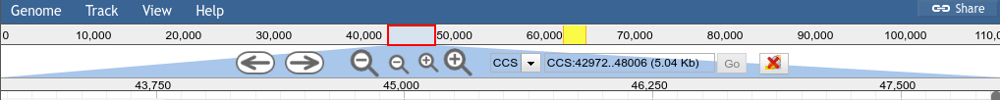
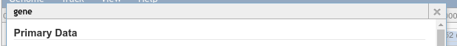

# ThemeComponent-Flat

A JBrowse 'Theme Component' which removes many of the shadows and "curved" background effects.




# Usage

Add the following to your `trackList.json`. If you have an existing plugins section, you should add the plugin to that section.

```json
"plugins": [
	{
		"name": "ThemeComponent-Flat",
		"location" : "https://cdn.rawgit.com/jbrowse-themes/ThemeComponent-Flat/1d495bb01af773f045f441bc20dec8281247be86"
	}
]
```

# LICENSE

GPL-3.0

# Support

This material is based upon work supported by the National Science Foundation under Grant Number (Award 1565146)
